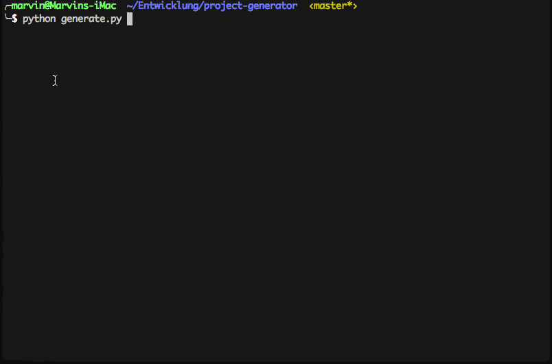

This Python script can generate Shoebill maven projects by giving it your Name, Version, Description, Artifact Id, Group Id and Project Location.

# Download

You can get yourself a pre-build binary from the [Releases](https://github.com/Shoebill/project-generator/releases) or you can use your own Python Interpreter and execute ```generator.py```.

# Requirements

* [Python 3](https://www.python.org/downloads/) if you want to run it via the Python Interpreter

# How to use it?



🎉🎉🎉 You successfully created a Shoebill Maven Project. Now you just need to import it into your IDE.
